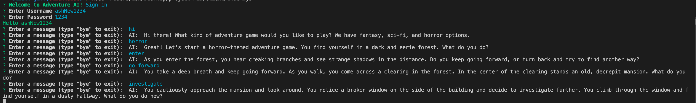

# api-server

## Project: The Timeless Tower

## Author: Tech-Flamingo Group

- [Ash Uppal](https://github.com/ashuppal)
- [Brenda Jow](https://github.com/brenda70904)
- [Martin Hansen](https://github.com/sp00nes)
- [Steve Gant](https://github.com/stevengant)

## Problem Domain

  The purpose of the text-based game is to engage the player in an interactive and immersive storytelling experience. The player can make choices that affect the outcome of the story which engages the user further into the game experience.

### Links and Resources

- [Tech-Flamingos - client repo](https://github.com/Tech-Flamingos/client)
- [Tech-Flamingos - server repo](https://github.com/Tech-Flamingos/server)

### Setup

.env requirement:

- PORT
- OPEN_AI_KEY=your open ai key

### How to initialize/run your application (where applicable)

node index.js

### How to use your library (where applicable)

- openAI
- join Room, mulitple users can join the same room to play the game.

Role Based Access Control: user, writer, admin.

### UML

.png)
